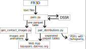

## RNA basepair processing scripts

### Setup

* Install Python (>=3.11) and [python-poetry](https://python-poetry.org/).
* Run `poetry install` (in this `/scripts` directory)
* Scripts which don't depend on PyMOL should now run using `poetry run ...`. For example:
    - `poetry run python3 ./pairs.py 1EHZ_basepair.txt --output 1ehz_params.csv` - calculates all implemented parameters for all basepairs found by FR3D
    - `poetry run python3 ./pairs.py *_basepair.txt --output all_params.csv --pdbcache /downloads/structures/into/here` - same, but for many structures with a cache directory
    - `poetry run python3 ./pair_distributions.py --skip-image --output-dir out/ all_params.csv.parquet` - generates plots and basic stat files into the out/ directory
    - `poetry run python3 ./pair_distributions.py --skip-image --reexport=partitioned --output-dir out/ all_params.csv.parquet` - same, plus export basepair tables partitioned by the class with KDE-based niceness columns (needed for the webapp)
* The environment includes IPython, Jupyter kernel can be set up using `poetry run python -m ipykernel install --user --name {name} --display-name "Python ({name})"`
* The `gen_contact_images.py` (and `pair_distributions.py` without `--skip-image`) requires PyMOL, which isn't on PyPI and therefore cannot be installed by Poetry.
    * PyMOL probably needs to be installed system-wide, other packages can then be in non-poetry virtualenv when `--system-site-packages` is used.
    * Since the exact installation process depends on the OS/distribution, it is left as an *excercise to the reader* (hint: in Czechia, good place to get the sacrifice animals is [bazos.cz](https://zvirata.bazos.cz/koza/), young goats seem to be Python favorites)
    * If you only need `gen_contact_images.py` without the integration into histograms, it is maybe sufficient to install `polars` and `numpy` system-wide.

### Usage

The following figure summarizes the data flow through the different scripts.

Documentation for all options is available via the `--help` flag.
